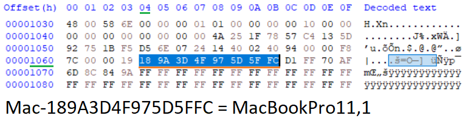

## Finding a device board-id

Sometimes, a technician may not be aware, or unsure of a device board-id. Here are some methods of retrieving and confirming said data. You may then check if your device is supported in [COMPATIBILITY.MD](COMPATIBILITY.md).

---
### Using smbinfo.efi:-

Step 1. Boot SMCFT shell, making sure 'startup.nsh' runs.\
Step 2. Type `smbinfo` then press enter.

<kbd></kbd>

---
### Using smbiosview:-

Step 1. Boot SMCFT shell, you may skip loading 'startup.nsh'.\
Step 2. Type `smbiosview -t 2`, and press enter until you can see the `ProductName` string.

<kbd></kbd>

---
### Using an EFIROM firmware dump:-

Step 1. Dump the device SPIROM contents with a programmer.\
Step 2. Open the dump in a hex editor.\
Step 3. Head to offset `0x1064h`, the 8-byte board-id should be available.

<kbd></kbd>

> ⚠ This data doesn't seem to be available in pre-2012 EFI firmware.
