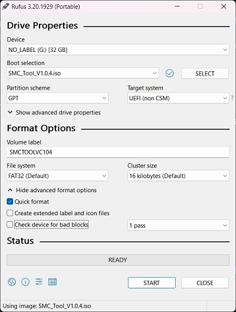
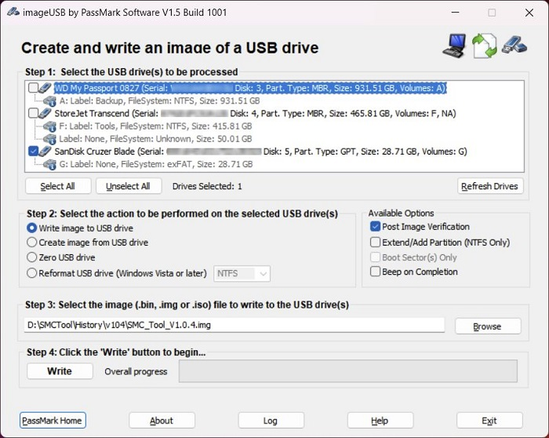

## Bootable USB creation:

To begin, format a USB disk in ExFAT, FAT32, VFAT or HFS+ for use with SMCFT.
> ⚠ FAT32 using a GUID Partition Table (GPT) is recommended.

Once the memory stick is ready, you can do any of the following:
- Option A: Manually copy all files from the ISO to the formatted memory stick.
- Option B: Write the image to the memory stick with ddrescue, Passmark imageUSB, or similar.
- Option C: Use a bootable USB creation tool and select the ISO, or image as the source file, and the memory stick as the destination.

---

## Windows:

#### Using Rufus:

1. Acquire a copy of Rufus from [here](https://github.com/pbatard/rufus/releases).
2. Open Rufus and select the memory stick from the device dropdown list.
3. Click the `SELECT` button and choose [SMCFT.iso](https://github.com/MuertoGB/SMCFT/releases) as the media.
4. Choose partition scheme `GPT` and target system `UEFI`.
5. Under `Format Options`, select `Show advanced format options` and deselect `Create extended label and icon files`.
6. Click the `START` button, Rufus will then do the rest for you.

---

#### Write the image directly:

1. Acquire a copy of [imageUSB by PassMark](https://www.softpedia.com/get/System/File-Management/ImageUSB.shtml).
2. Open imageUSB and select the memory stick from the tree list.
3. Ensure the `Write image to USB drive` radio button is checked.
4. Click the `Browse` button and choose [SMCFT.img](https://github.com/MuertoGB/SMCFT/releases) as the media.
5. Click the `Write` button, imageUSB will then do the rest for you.

---

