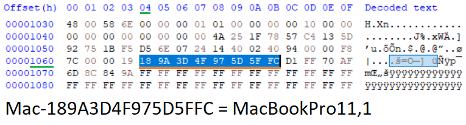

## Compatibility Information

This information is still a work in progress, I've only so many machines at my disposal to verify board-ids and perform a test flash. If a model is marked as verified, this means it was successfully flashed with SMCFT. If a model is not in the below list, it isn't currently supported.

If you'd like to verify a successful SMC flash, please [open an issue](https://github.com/MuertoGB/SMCFT/issues). Make include the following information:

`Model Identifier, SMC Version, EMC Number, Board Model, Graphics Card (Model, VRAM), board-id.`
```bash
system_profiler SPHardwareDataType | grep "Model Identifier"
system_profiler SPHardwareDataType | grep "SMC Version"
system_profiler SPDisplaysDataType | grep "Chipset Model"
system_profiler SPDisplaysDataType | grep "VRAM"
ioreg -l | grep -i board-id

EMC Number found on Chassis, e.g. 'EMC2632'.
Board model found on Logic board, e.g. '820-3437'.
```

**If you're unsure at any point of the board-id, you can do the following:-**

> ℹ This information doesn't seem to be available within pre-2012 EFIROMs.

Step 1. Dump the SPIROM contents.\
Step 2. Open the dump in a hex editor.\
Step 3. Head to offset `0x1064`, the 8-byte board-id should be available.



---

<h4 align="center">Platform Navigation</h4>
<p align="center">
  <a href="#macbook-air">MacBook Air</a> •
  <a href="#macbook-pro">MacBook Pro</a> •
  <a href="#mac-mini">Mac Mini</a> •
  <a href="#imac">iMac</a>
</p>

## MacBook Air

#### A1465

```
MacBookAir6,1 (11-inch Mid 2013, Early 2014), EMC 2631

 - Board Model:  820-3435
 - Board-ID:     Mac-35C1E88140C3E6CF
 - Firmware:     2.12f143
 - Flash using:  820-3435.nsh
```

```
MacBookAir7,1 (11-inch Early 2015), EMC 2924

 - Board Model:  820-00164
 - Board-ID:     Mac-9F18E312C5C2BF0B
 - Firmware:     2.26f2
 - Flash using:  820-00164.nsh
```

#### A1466

```
MacBookAir6,2 (13-inch Mid 2013,  Early 2014), EMC 2632
✅ Verified

 - Board Model:  820-3437
 - Board-ID:     Mac-7DF21CB3ED6977E5
 - Firmware:     2.13f15
 - Flash using:  820-3437.nsh
```

```
MacBookAir7,2 (13-inch Early 2015), EMC 2925
MacBookAir7,2 (13-inch 2017), EMC 3178
✅ Verified

 - Board Model:  820-00165
 - Board-ID:     Mac-937CB26E2E02BB01
 - Firmware:     2.27f2
 - Flash using:  820-00165.nsh
```

## MacBook Pro

#### A1502

```
MacBookPro11,1 (13-inch Late 2013, Mid 2014), EMC 2678, EMC 2875
✅ Verified

 - Board Model:  820-3476
 - Board-ID:     Mac-189A3D4F975D5FFC
 - Firmware:     2.16f68
 - Flash using:  820-3476.nsh
```

> 

```
MacBookPro11,1 (13-inch Late 2013, Mid 2014), EMC 2678, EMC 2875 (4GB RAM)
✅ Verified

 - Board Model:  820-3536
 - Board-ID:     Mac-189A3D4F975D5FFC
 - Firmware:     2.16f68
 - Flash using:  820-3536.nsh
```

```
MacBookPro12,1 (13-inch Early 2015), EMC 2835
✅ Verified

 - Board Model:  820-4924 
 - Board-ID:     Mac-E43C1C25D4880AD6
 - Firmware:     2.28f7
 - Flash using:  820-4924.nsh
```

#### A1398

```
MacBookPro11,2 (15-inch Late 2013 with iGPU), EMC 2674
MacBookPro11,3 (15-inch Mid 2014 with iGPU), EMC 2745
✅ Verified

 - Board Model:  820-3662
 - Board-ID:     Mac-3CBD00234E554E41
 - Firmware:     2.18f15
 - Flash using:  820-3662.nsh
```

```
MacBookPro11,2 (15-inch Late 2013 with dGPU), EMC 2876
MacBookPro11,3 (15-inch Mid 2014 with dGPU), EMC 2881

 - Board Model:  820-3787
 - Board-ID:     Mac-2BD1B31983FE1663
 - Firmware:     2.19f12
 - Flash using:  820-3787.nsh
```

```
MacBookPro11,4 (15-inch Mid 2015 with iGPU), EMC 2909
✅ Verified

 - Board Model:  820-00138
 - Board-ID:     Mac-06F11FD93F0323C5
 - Firmware:     2.29f24
 - Flash using:  820-00138.nsh
```

```
MacBookPro11,5 (15-inch Mid 2015 with dGPU), EMC 2910

 - Board Model:  820-00163
 - Board-ID:     Mac-06F11F11946D27C5
 - Firmware:     2.30f2
 - Flash using:  820-00163.nsh
```

```
MacBookPro11,5 (15-inch Mid 2015 with dGPU), EMC 2910

 - Board Model:  820-00426
 - Board-ID:     Mac-06F11F11946D27C5
 - Firmware:     2.30f2
 - Flash using:  820-00426.nsh
```

## Mac Mini

#### A1347

```
MacMini7,1 (Late 2014-2017), EMC 2840

 - Board Model: 820-5509
 - Board-ID: Mac-35C5E08120C7EEAF
 - Firmware: v2.24f32
 - Flash using 820-5509.nsh
```

## iMac

#### A1418

```
iMac14,1 (21.5-inch, Late-2013, with dGPU), EMC 2638

 - Board Model:  820-3482
 - Board-ID:     Mac-031B6874CF7F642A
 - Firmware:     v2.14f24
 - Flash using:  820-3482.nsh
```

```
iMac14,3 (21.5-inch, Late-2013, with iGPU), EMC 2742

 - Board Model:  820-3588
 - Board-ID:     Mac-77EB7D7DAF985301
 - Firmware:     v2.17f7
 - Flash using:  820-3588.nsh
```

```
iMac14,4 (21.5-inch, Mid-2014), EMC 2805

 - Board Model:  820-4668
 - Board-ID:     Mac-81E3E92DD6088272
 - Firmware:     v2.21f92
 - Flash using:  820-4668.nsh
```

```
Mac 16,1 (21.5-inch, Late 2015, Intel HD 6000 iGPU), EMC 2889

 - Board Model:  820-00430
 - Board-ID:     Mac-A369DDC4E67F1C45
 - Firmware:     v2.31f37
 - Flash using:  820-00430.nsh
```

```
iMac 16,2 (21.5-inch, Late 2015, Intel Iris Pro 6200 iGPU), EMC 2833

 - Board Model:  820-00431
 - Board-ID:     Mac-FFE5EF870D7BA81A
 - Firmware:     v2.32f21
 - Flash using:  820-00431.nsh
```

#### A1419

```
iMac14,2 (27-inch, Late-2013, 1GB VRAM), EMC 2639

 - Board Model:  820-3478
 - Board-ID:     Mac-27ADBB7B4CEE8E61
 - Firmware:     v2.15f7
 - Flash using:  820-3478.nsh
```

```
iMac14,2 (27-inch, Late-2013, 2GB VRAM), EMC 2639

 - Board Model:  820-3481
 - Board-ID:     Mac-27ADBB7B4CEE8E61
 - Firmware:     v2.15f7
 - Flash using:  820-3481.nsh
```

```
iMac15,1 (27-inch, Late-2014, Mid-2015, 2GB VRAM), EMC 2806

 - Board Model:  820-4652
 - Board-ID:     Mac-42FD25EABCABB274
 - Firmware:     v2.22f16
 - Flash using:  820-4652.nsh
```

```
iMac15,1 (27-inch, Late-2014, 4GB VRAM), EMC 2806

 - Board Model:  820-5029
 - Board-ID:     Mac-FA842E06C61E91C5
 - Firmware:     v2.23f11
 - Flash using:  820-5029.nsh
 ```

> ℹ 820-00291/00292 payloads are identical. Unsure why there was a board revision as they both have 2GB VRAM and M380/M390.

```
iMac17,1 (27-inch, Late-2015, 2GB VRAM), EMC 2834

 - Board Model:  820-00291
 - Board-ID:     Mac-65CE76090165799A
 - Firmware:     v2.33f12
 - Flash using:  820-00291.nsh
```
 
```
iMac17,1 (27-inch, Late-2015, 2GB VRAM), EMC 2834

 - Board Model:  820-00292
 - Board-ID:     Mac-DB15BD556843C820
 - Firmware:     v2.33f12
 - Flash using:  820-00292.nsh
```

```
iMac17,1 (27-inch, Late-2015, 4GB VRAM), EMC ?2834?

 - Board Model:  820-00134
 - Board-ID:     Mac-B809C3757DA9BB8D
 - Firmware:     v2.34f3
 - Flash using:  820-00134.nsh
```
 
---
